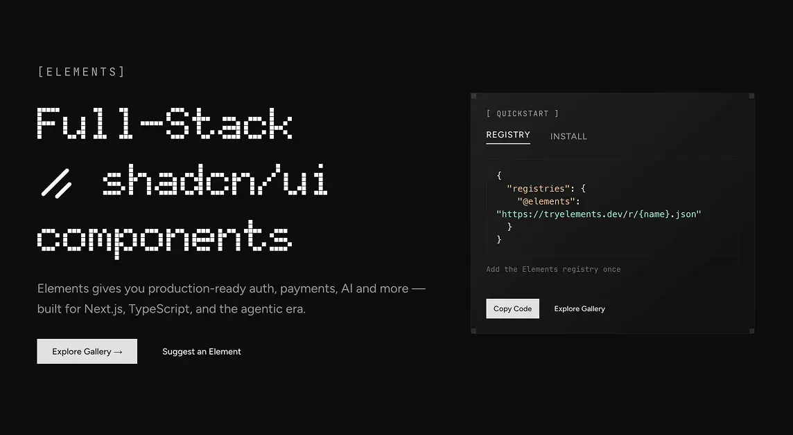
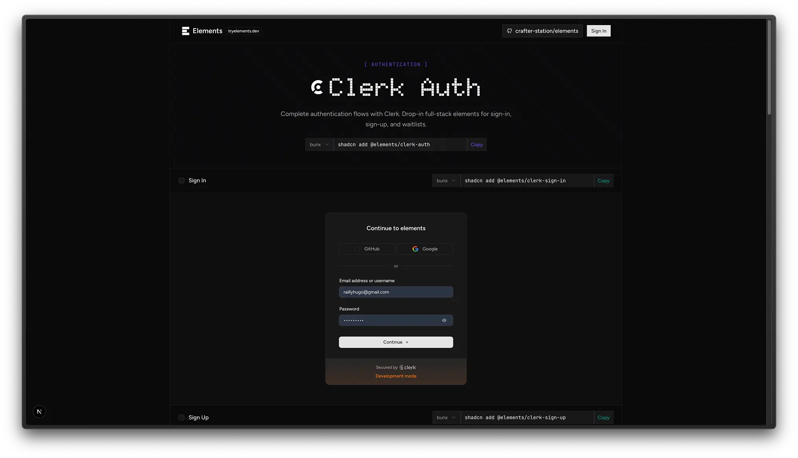
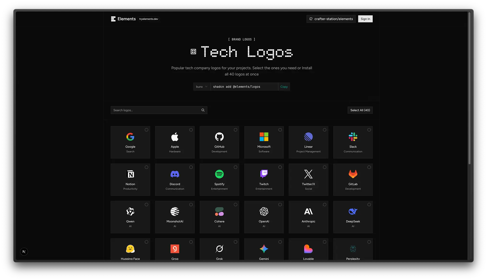

<p align="center">
  
</p>

<h1 align="center">Elements</h1>

Full-stack components ready for the agentic era. Install flows, not pixels.



## Quick Start

1. Add Elements registry to your `components.json` file:

```json
{
  "registries": {
    "@elements": "https://tryelements.dev/r/{name}.json"
  }
}
```

2. Install any element you want using the `bunx shadcn@latest add` command.

```bash
bunx shadcn@latest add @elements/logos
```

## Available Components

### Clerk Auth

Complete authentication flows with sign-in, sign-up, and waitlist components.



### Tech Logos

Popular brand logos collection with shopping cart functionality.



### Theme Switcher

Dark/light mode toggles with multiple variants.

**More coming soon...**

## Registry

Visit [tryelements.dev](https://tryelements.dev) to browse all components.

---

Built with Next.js, TypeScript, and shadcn/ui.
